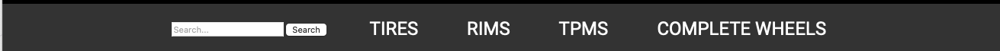
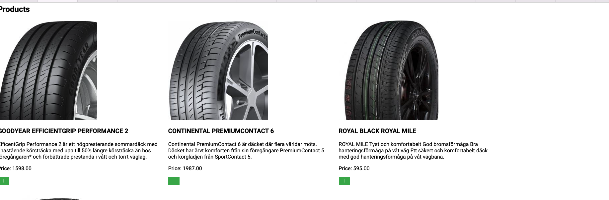
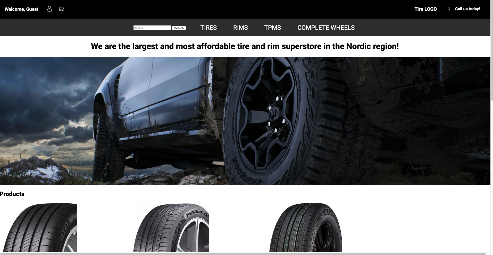
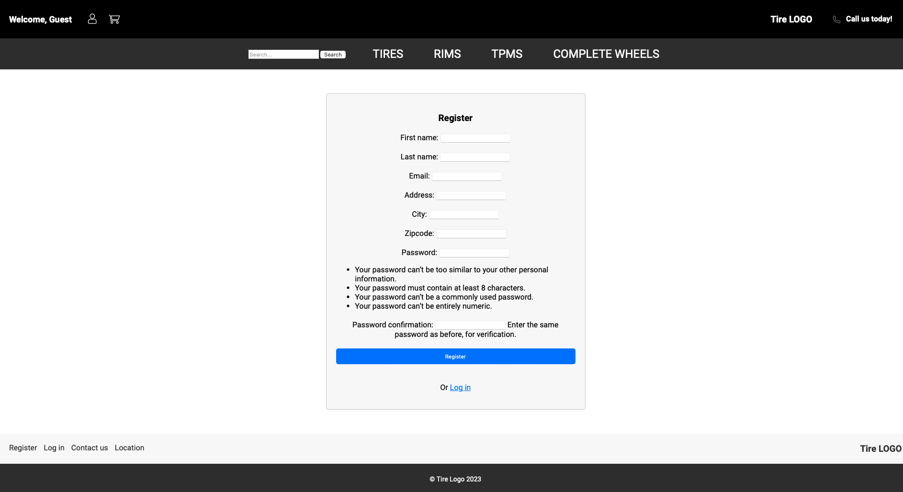
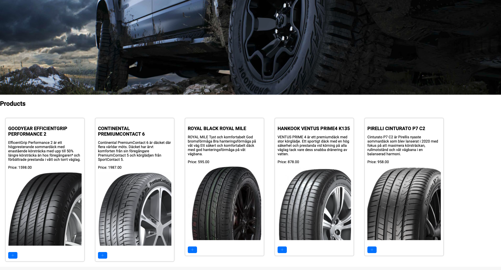
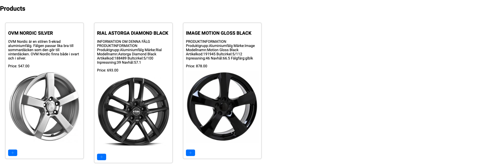
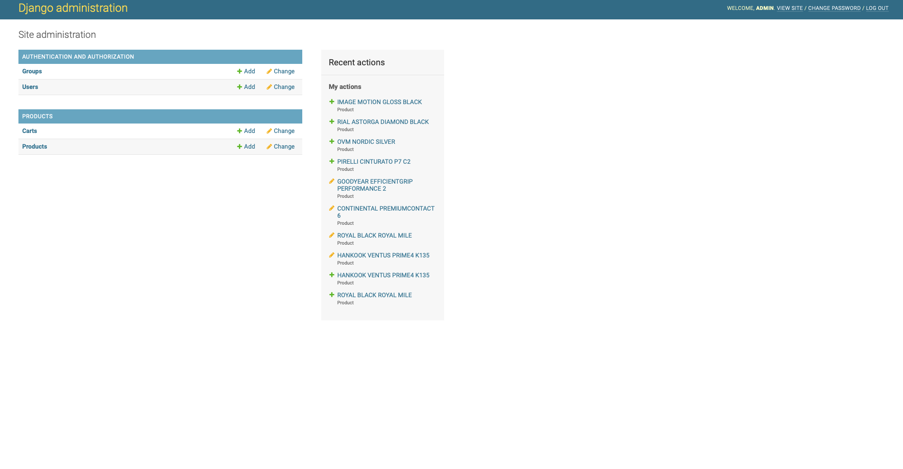

# Tire Webshop

Tire Webshop is a web application built with Django, allowing users to browse, search, and purchase tires and rims online. It provides a user-friendly interface for customers to explore various tire options, view detailed product information, and add items to their shopping cart.

This is an ongoing project and not a finished result. Future updates will come.

## Features

- Product Listing: Display a wide range of tire and rim products with their  details, including title, description, price, and an accompanying image.

- Search: Allow users to search for specific tire or rim products using keywords or filters to find the desired items quickly.

- Shopping Cart: Enable customers to add products to their shopping cart, review the cart contents, and proceed to checkout for purchase.

- User Authentication: Provide user registration and login functionality to manage personal information and track order history.

- Responsive Design: Ensure the webshop is accessible and optimized for various devices, including desktops, tablets, and mobile phones.

## Index – Table of Contents
* [User Experience (UX)](#user-experience-ux)
  * [Project Goals:](#project-goals)
  * [Strategy:](#strategy)
  * [User stories:](#user-stories)
* [Features](#features)
  * [Existing Features](#existing-features)
    * [Navigation bar:](#navigation-bar)
    * [Home page:](#home-page)
    * [Blog page:](#blog-page)
    * [Add post page:](#add-post-page)
    * [Post detail page:](#post-detail-page)
    * [Post update page:](#post-update-page)
    * [Comment update page:](#comment-update-page)
    * [Register page:](#register-page)
    * [Login page:](#login-page)
    * [Logout page:](#logout-page)
    * [Django Admin page:](#django-admin-page)
    * [System messages:](#system-messages)
    * [Footer:](#footer)
    * [Additional features:](#additional-features)
    * [Meta Data:](#meta-data)
  * [Features to Implement in the future](#features-to-implement-in-the-future)
* [Design](#design)
  * [Wireframes](#wireframes)
  * [Data Model](#data-model)
  * [Site map](#site-map)
  * [Colours](#colours)
  * [Typography](#typography)
  * [Imagery](#imagery)
* [Technologies Used](#technologies-used)
  * [Languages Used:](#languages-used)
  * [Frameworks and Libraries Used:](#frameworks-and-libraries-used)
  * [Software and Web Applications Used:](#software-and-web-applications-used)
* [Testing](#testing)
  * [Browser Testing](#browser-testing)
  * [Responsiveness](#responsiveness)
  * [Validator Testing](#validator-testing)
    * [W3C Markup Validator:](#w3c-markup-validator)
    * [W3C CSS Validator:](#w3c-css-validator)
    * [JSHint:](#jshint)
    * [PEP8 Online:](#pep8-online)
    * [Lighthouse:](#lighthouse)
  * [Automated Testing](#automated-testing)
    * [Jest:](#jest)
    * [Django testing tools:](#django-testing-tools)
  * [User Stories testing](#user-stories-testing)
    * [Testing which features support which stories](#testing-which-features-support-which-stories)
  * [Further Testing](#further-testing)
  * [Solved bugs](#solved-bugs)
  * [Known bugs](#known-bugs)
* [Deployment](#deployment)
* [Credits](#credits)
  * [Code](#code)
  * [Acknowledgements](#acknowledgements)

## User Experience (UX)

### Project Goals:
The primary goal for this project is to create a tire webshop, aiming to sell tires and rims here in scandinavia.

### Strategy:
An Agile methodology was used to plan this project. This was implemented using a board in GitHub Project. To cover the goals of this project, a total of 8 user stories was created. 

The following labels were used in this project and the distribution of user stories by label are:

  - Must-Have: 3/6
  - Should-Have: 2/6
  - Could-Have: 1/6

For more information: [View the Kanban Board here.](https://github.com/mittnamnkenny/fishtales/projects/1).

## User Stories

- As a *Site User* I can *register my payment details* so that *I can finalize my purchase*

- As a *Site User* I can *create an account on the site* so that *I can see and save my order history for future purchases*

- As a *Site User* I can *see my shopping cart and the calculated total price of my items* so that *I can see what the total cost of the purchase* 

- As a *Site User* I can *search for products on the site* so that *I can find items fast and easily*

- As a *Site User* I can *add items to the shopping cart * so that *I can collect the products I intend to buy in one place before my purchase*

- As a *Site Admin* I can *add, edit and delete product listings* so that *site users have access to the latest products and product information*

## Existing Features

### Navbars

#### Top Navbar

There are 2 navbar present on the top. The upper navbar is for log in, register and show cart. Implemented using icons.

Also it shows if your are logged in or not. If you are not logged in it will show "Welcome, guest" and if you are logged in "Welcome, (name)"

#### Top Lower Navbar

The lower top navbar is for navigating between categories and a search function, to search for products.

#### Landing page:

Index.html is the landing page and showing some tires as products.

#### Footer

Footer section contains Register, log in / log out. Depending if you are logged in or not. Register and log in will disapear if your logged in.

It also shows contact us and location (this is not yet working).

#### Register Page

Register page is where you register as an user. You have to provide:
- Email (used as username to)
- First Name
- Last Name
- Street
- Zip code
- Password

#### log In Page

You have to log in to buy on the page. Log in contains Username field(email) and password field.

#### Tire page

Here is where you can find the tires. Implemenation is yet to be updated due to size of the tires the coustomor wants. Here is is filtered to only show tires.

#### Rims page

Here is where rims are shows in different models.

#### Admin page

Here is where you as an admin can create user and create products. Products can be filtered by using category "Tires" and "Rims".

